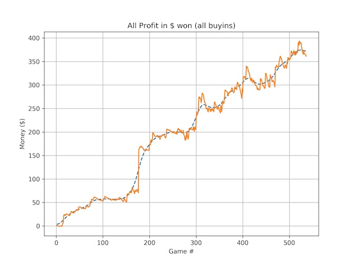

Poker Hand Tracker
=================

This is a poker hand tracker for tournaments and SnGs.   

This program processes the hand histories .txt files to extract some relevant data, such as hole cards, position, etc (see [What is extracted from hand histories / tournaments summaries text files](#data_extracted)).

A CLI has been created for convenience, to update the database with new hand histories, create plots, create PrettyPrintable tables, etc (see [Examples](#examples)).
 
It has been built to make it easy to extend it and add your own plots or tables with whatever data or insight you're looking for (see [Adding my own plots or table](#add_own_stuff)).


## Content

* [Command Line Options](#commandlineoptions)
* [Installation](#installation)


<div id="commandlineoptions"></div>

##Command Line Options

```
+-------------------------+--------+-----------------------------------------------------+-------------------------------------------------------+
|         Command         |  Type  |                      Parameters                     |                      Description                      |
+-------------------------+--------+-----------------------------------------------------+-------------------------------------------------------+
|        update-db        | action |                         None                        |       Updates the database with new tournaments       |
+-------------------------+--------+-----------------------------------------------------+-------------------------------------------------------+
|      setup-database     | action |                         None                        | Creates an empty database with the appropriate schema |
+-------------------------+--------+-----------------------------------------------------+-------------------------------------------------------+
|                         |        |                                                     |                                                       |
+-------------------------+--------+-----------------------------------------------------+-------------------------------------------------------+
|     show-money-graph    |  plot  |               optional: buyin (float)               |          Shows a line plot of the money graph         |
+-------------------------+--------+-----------------------------------------------------+-------------------------------------------------------+
|  show-reg-time-and-pos  |  plot  |                         None                        |    Shows a box plot representing the relationship     |
|                         |        |                                                     |      between registration time and final position     |
+-------------------------+--------+-----------------------------------------------------+-------------------------------------------------------+
|     show-profit-rate    |  plot  |               (optional) buyin (float)              |     Shows the the avg profit/tournament over time     |
+-------------------------+--------+-----------------------------------------------------+-------------------------------------------------------+
|     show-chip-graph     |  plot  |           (required) tournament ID (int)            |         Shows the chip graph for a tournament         |
+-------------------------+--------+-----------------------------------------------------+-------------------------------------------------------+
|        show-range       |  plot  |             (required) player name (str)            |           Shows the range of hands observed           |
|                         |        | (required) position: blinds | early | middle | late |                for a particular player                |
+-------------------------+--------+-----------------------------------------------------+-------------------------------------------------------+
|                         |        |                                                     |                                                       |
+-------------------------+--------+-----------------------------------------------------+-------------------------------------------------------+
| show-last-n-tournaments | table  |                     (required) n                    |              Shows the last n tournaments             |
+-------------------------+--------+-----------------------------------------------------+-------------------------------------------------------+
|   show-report-by-buyin  | table  |                         None                        |           Shows statistics about each buy-in          |
+-------------------------+--------+-----------------------------------------------------+-------------------------------------------------------+
```

<div id="installation"></div>

Installation
--------------------

Step 1 | Make sure `matplotlib`, `scipy`, `PrettyTable` and `Click` are all installed.

Step 2 | Clone this repo, and run

    $ python cli.py setup-db

This will set up the database with the appropriate schema.

Step 3 | Open `GLOBAL_VARIABLES.py` and write this for the 4 variables:

* `PLAYER_NAME`: your playing username 
* `HAND_HISTORY_FOLDER`: the absolute path where the hand histories files are located
* `TOURNEY_SUMMARY_FOLDER`: the absolute path where the tournament summaries files are located
* `TOURNAMENTS_TO_EXTRACT`: this one is slightly tricky. This is the list of tournaments you want to track, along with their buyins amount including rake. You need to find the common pattern between those filenames.
For example, let's say you play SnGs and cash games, and you want to track the $3 and $6 SnGs you are playing. So you hand history folder look like this:

```
...
HH20210223 SITGOID-G24121376T1 TN-$3 Hold'Em Turbo - On Demand GAMETYPE-Hold'em LIMIT-no CUR-REAL OND-T BUYIN-0.txt
HH20210223 SITGOID-G24121376T2 TN-$3 Hold'Em Turbo - On Demand GAMETYPE-Hold'em LIMIT-no CUR-REAL OND-T BUYIN-0.txt
HH20210223 SITGOID-G24120630T2 TN-$3 Hold'Em Turbo - On Demand GAMETYPE-Hold'em LIMIT-no CUR-REAL OND-T BUYIN-0.txt
... some cash game files ...
HH20210223 SITGOID-G24113211T3 TN-$6 Hold'Em Turbo - On Demand GAMETYPE-Hold'em LIMIT-no CUR-REAL OND-T BUYIN-0.txt
HH20210223 SITGOID-G24113211T1 TN-$6 Hold'Em Turbo - On Demand GAMETYPE-Hold'em LIMIT-no CUR-REAL OND-T BUYIN-0.txt
...
```

The common pattern for the $3's could be `$3 Hold'Em Turbo - On Demand` for example. If you just write `$3` for example it will not work, 
since there's probably other files in this folder that have `$3` in their name but are not $3 SnGs. So for me, playing the $0.55, $1.65, $3.3 and $6.6 buy-in levels, this variable was always set to:

```python
TOURNAMENTS_TO_EXTRACT = {
    "$0{FULLSTOP}50 Hold'Em Turbo": 0.55,
    "$1{FULLSTOP}50 Hold'Em Turbo": 1.65,
    "$3 Hold'Em Turbo - On Demand": 3.30,
    "$6 Hold'Em Turbo - On Demand": 6.60}
```

Step 4 | Now, if you run `python cli.py update-db` it should import all your tournaments and hands. This can take a few minutes if you have a large number of hand histories. It will tell you how many tournaments/sngs it has added in the end. When you go back to playing, you'll have to re-run this command and it will import only the new hand histories.  
 
Step 5 | Run `python cli.py --help` to see the things you can do.


<div id="examples"></div>

Examples
--------------------
`$ python cli.py show-money-graph` 

.jpg?raw=true "Money Graph")



--------------------

`$ python cli.py range PotNoodle99912 middle` 


--------------------

`$ python cli.py show-chip-graph 23075960` 


--------------------

`$ python cli.py show-profit-rate` 

.jpg?raw=true "profit rate")

--------------------

`$ python cli.py show-reg-time-and-pos` 


Create new plots / tables and deriving new insights
--------------------

For example, let's say you want to see the amount of chips won / lost by position. The entire hand history is also stored in the database, in the `hand_txt` section in case you want to access it directly. 

1. Create a script that queries the SQL database and displays it in a table form (see `/db_api/` for some examples).
2. Create a new file in `cli_commands/` containing the CLI script that gets run when the command is called from the terminal. You can use this a wrapper, so if you have one command that does something, another that does something else and a third one that combines everything, you can wrap them up here.
3. Finally update `cli.py` to use that new script from the CLI for convenience


___


Folder structure and notes
--------------------

* I have use SQLite as my database of choice, for ease of use and easy debugging. I recommend using the excellent [DB Browser for SQLite](https://github.com/sqlitebrowser/sqlitebrowser) to be able to open the .db database file.
* As per the license, the author is not responsible if you misuse this tool or lose your hand histories.
* To make it easy to build the complex Hand and Tournament classes, I have used the Builder Design pattern.
* I do not intend to compete in any way with the major commercial poker trackers when I built this project. I did it for fun, and to practice a variety of skills. Use this tool if you know how to code and want to derive interesting stats about your play with SQL/Python and don't want to build the database code to do so.
* I play on ACR, so it is using the ACR hand histories and the tournament summaries files. It should not be hard to port this tool to be used with other sites like PokerStars.
* This is built for tournaments and SnGs and I never used it for cash games. But you should also be able to port this code easily if you want to track cash games. 

Here is the folder structure:
```
    cli.py                                # 
    
    ├── /__tests__/     
    
    ├── /database/     

    ├── /hh_import/                       
        ── get_raw_hh_from_file.py        # returns an array of not-yet-processed .txt files
        ── extract_from_raw_hh.py         # extracts relevant data from .txt files
        ── store_hh_sqlite_db.py          # stores new data in the sqlite db
        
    ├── /add_notes/                        
        ── add_hand_note.py               # adds a note linked to a hand ID
        ── add_tournament_note.py         # adds a note linked to a tournament ID
        
    ├── /db_api/                         
        ├── /tournaments/                 # 
            ── get_tournaments.py         # 
        ├── /hands/                       # 
        ├── /summaries/                   # 
        
    ├── /helpers/                         
```

Copyright
--------------------

Copyright (c) 2021 Michael Cukier. See LICENSE for details.